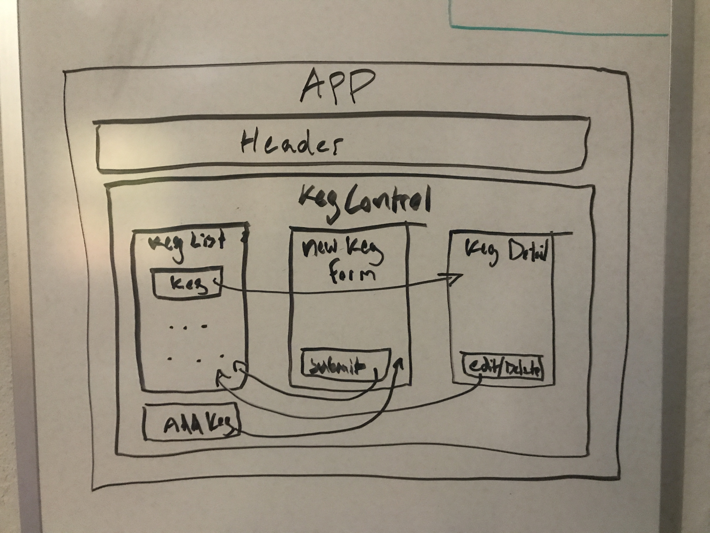

# _Keg Tracker_

#### _Track Kegs Bought and Pints Sold_

#### By _**Jason Khan**_

## Description

_This will be a two-week project. Spend today building a tap room in React where a bar or kombucha store can track their kegs._

1.  As a user, I want to see a list/menu of all available kegs. For each keg, I want to see its name, brand, price and alcoholContent or perhaps something like flavor for a kombucha store.
2.  As a user, I want to submit a form to add a new keg to a list.
3.  As a user, I want to be able to click on a keg to see its detail page.
4.  As a user, I want to see how many pints are left in a keg. Hint: A full keg has roughly 124 pints.
5.  As a user, I want to be able to click a button next to a keg whenever I sell a pint of it. This should decrease the number of pints left by 1. Pints should not be able to go below 0.

## Component Diagram

## Setup/Installation Requirements

* _Visit the following link: https://github.com/jasonkhan99/keg-tracker_
* _Clone the repository to your desired directory._
* _Type `npm install`, then `npm start` into the terminal` Open [http://localhost:3000](http://localhost:3000) to view it in the browser.

## Known Bugs

_No known bugs_

## Support and contact details

_Please reach out through my GitHub account._

## Technologies Used

* _HTML_
* _JavaScript_
* _VSCode_
* _React_

### License

MIT License.

Copyright (c) 2020 **_Jason Khan_**